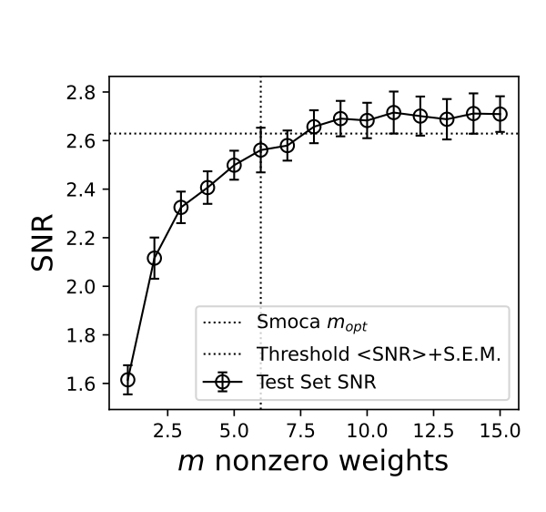
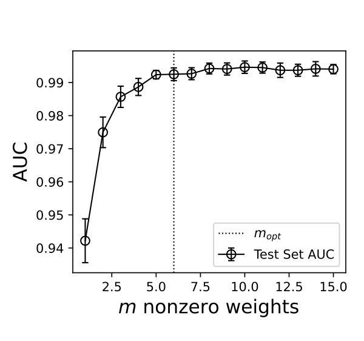
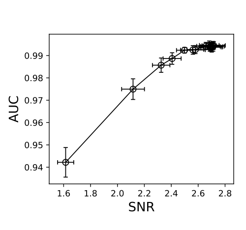
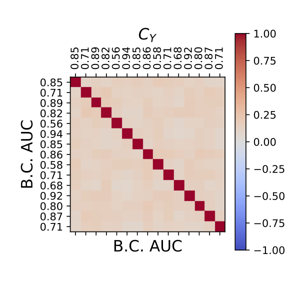

# Example Script

The `demonstrate_subset_selection.py` script 
peforms k fold cross-validation and greedy ensemble 
selection on simulation data.  Resulting plots are
printed to file in a user defined designated directory.

## Running the script and output

We can run the script from the command line by:

```
python demonstrate_subset_selection.py \
    --auc 0.52 0.95 \
    --m_classifiers 15 \
    --seed 42 \
    sim_results
```

which will produce several results.

First, and most important is a demonstration of the 
greedy ensemble selection procedure.  The vertical
dashed line is the optimal number of base classifiers
produced by `Smoca`.  The horizontal dashed line shows
the threshold used for ensemble selection.  From in 
independent random cross-validation that uses the
same random seed as `Smoca`.  The threshold is plotted
from the simulation data, and not `Smoca` as `Smoca` does
not keep track of intermediate ensemble SNR values.  The
threshold is computed as:

threshold = (maximum mean SNR) - (S.E.M. of max mean SNR)

As explained in [1] the optimal ensemble number is
determined by the smallest number of base classifiers
such that

(mean SNR) + (S.E.M) >= threshold



Now that we see that the ensemble selection is working
as designed, we plot a more common measure of performance AUC.



and we see that the AUC and SNR are similar measures
of performance



Lastly, we plot the conditional correlation matrix used 
for simulating the scores of samples from the respective
classes




## References

[1] T. Hastie, R. Tibshirani, and J. Friedman. **The Elements
of Statistical Learning** *Springer Series in Statistics* 
2:12, 2009.
